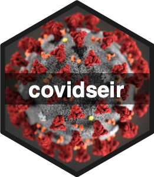

# covidseir 

> Bayesian SEIR Modelling for Multivariate COVID-19 Case Data

<!-- badges: start -->
[](https://github.com/seananderson/covidseir/actions)
[](https://www.tidyverse.org/lifecycle/#experimental)
<!-- badges: end -->

## Overview

**covidseir** fits a Bayesian SEIR (Susceptible, Exposed, Infectious, Recovered)
model to daily COVID-19 case data. The package focuses on estimating the
fraction of the usual contact rate for individuals participating in physical
distancing (social distancing). The model is coded in
[**Stan**](https://mc-stan.org/). The model can accommodate multiple types of
case data at once (e.g., reported cases, hospitalizations, ICU admissions) and
accounts for delays between symptom onset and case appearance.

The model is a continuation of the model described in the papers:

Anderson, S. C., Edwards, A. M., Yerlanov, M., Mulberry, N., Stockdale, J., Iyaniwura, S. A., Falcao, R. C., Otterstatter, M. C., Irvine, M. A., Janjua, N. Z., Coombs, D., & Colijn, C. (2020). Quantifying the impact of COVID-19 control measures using a Bayesian model of physical distancing. PLoS Computational Biology. 16(12): e1008274. https://doi.org/10.1371/journal.pcbi.1008274

Anderson, S. C., Mulberry, N., Edwards, A. M., Stockdale, J. E., Iyaniwura, S. A., Falcao, R. C., Otterstatter, M. C., Janjua, N. Z., Coombs, D., and Colijn, C. (2021). How much leeway is there to relax COVID-19 control measures? Epidemics. 100453. https://doi.org/10.1016/j.epidem.2021.100453

[Illustration for logo by Alissa Eckert, MSMI; Dan Higgins, MAMS](https://phil.cdc.gov/Details.aspx?pid=23311).

*This package is a work in progress: arguments and output format may still change and not all functionality has been tested.*

## Installation

Before installation, you will need a C++ compiler installed to compile the Stan model. Follow the relevant instructions on configuring a C++ toolchain for your operating system [on the rstan wiki](https://github.com/stan-dev/rstan/wiki/RStan-Getting-Started).

The following must return `TRUE` before continuing:

```r
# install.packages("pkgbuild")
pkgbuild::has_build_tools(debug = TRUE)
```

Then, install the covidseir package with:

```r
# install.packages("remotes")
remotes::install_github("seananderson/covidseir")
```

See the examples in `?fit_seir` and `?project_seir` and the [vignette](https://seananderson.github.io/covidseir/articles/fitting-case-data.html).

To install the package with the vignette:

```r
remotes::install_github("seananderson/covidseir", build_vignettes = TRUE)
```

and run:

```r
browseVignettes("covidseir")
```
